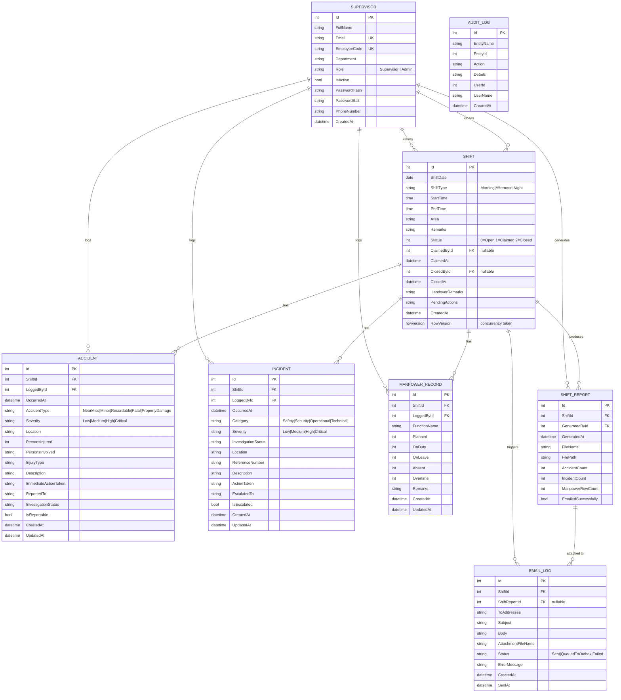

# ERD — Shift Handover System

Database: **SQL Server** (LocalDB for development) · ORM: **Entity Framework Core 9**
Physical schema: [`schema.sql`](schema.sql) (generated by `dotnet ef migrations script`)

---

## 1. Entity Relationship Diagram



---

## 2. Tables in plain English

| Table | Purpose | Rows created when |
|---|---|---|
| `Supervisors` | Login accounts. Stores a PBKDF2 hash + salt, never a plain password. | Seeded |
| `Shifts` | The duty slots (date + Morning/Afternoon/Night). Holds the **claim** and the **close** state. | Admin generates the roster |
| `Accidents` | Injury / damage records raised during a shift. | Supervisor logs while the shift is claimed |
| `Incidents` | Non-injury events (technical, security, operational…). | Supervisor logs while the shift is claimed |
| `ManpowerRecords` | Head count per function for the shift (planned / on duty / leave / absent / overtime). | Supervisor logs while the shift is claimed |
| `ShiftReports` | One row per generated PDF: file name, path and the counts printed in it. | Shift is closed |
| `EmailLogs` | Audit of the automatic distribution — who was told, what was attached, and whether it was delivered. | Shift is closed |
| `AuditLogs` | Generic trail of state changes (Claim, Release, Close, GenerateAndDistribute). | Any state change |

---

## 3. Relationships and why they are drawn this way

### `Supervisor 1—N Shift` (twice)

`Shifts` has **two** foreign keys back to `Supervisors`:

* `ClaimedById` — who took the shift.
* `ClosedById` — who ended the duty.

They are separate because they answer different audit questions ("who ran the shift?" vs "who signed it off?"), and in a real operation a relief supervisor can close a shift they did not claim. Both are **nullable** so a freshly generated shift can exist with nobody on it, and both use `ON DELETE RESTRICT` — you cannot delete a user who has shift history.

### `Shift 1—N Accident / Incident / ManpowerRecord`

Every log row belongs to **exactly one** shift. `ShiftId` is `NOT NULL` — a log entry with no shift is meaningless, because the handover PDF is built per shift.

`ON DELETE CASCADE` from `Shifts`: shifts are operational records, and if a draft shift is deleted its logs must not be orphaned.

Each log row also carries `LoggedById → Supervisors`. This is deliberate redundancy: it answers "who typed this in?" separately from "whose shift was it?", which matters if the shift is later released or if an admin ever has to correct attribution.

### `Shift 1—N ShiftReport`

A shift can be reported more than once — every close generates a report, and an admin can press **Re-send** to regenerate it. The history is kept rather than overwritten so the report trail is append-only.

### `ShiftReport 1—N EmailLog`

Each report row records the exact PDF that was attached to each e-mail. `ShiftReportId` is **nullable** and `ON DELETE SET NULL`, because an e-mail log entry must survive even if the report row is purged.

### `Shift 1—N EmailLog`

`ON DELETE RESTRICT` rather than `CASCADE`. SQL Server rejects cascading paths that would reach `EmailLogs` twice (`Shifts → ShiftReports → EmailLogs` and `Shifts → EmailLogs`), and deliberately so: the e-mail log is compliance evidence and should not disappear because a shift row was removed.

### `AuditLog` — deliberately unlinked

`AuditLog` has `UserId` and `EntityId` as **plain integers with no foreign key**. An audit trail must never be blocked or nullified by a foreign key, and it must still record an action when the referenced row has since been deleted. The trade-off is that the reference can dangle, which is the correct trade-off for an audit table.

---

## 4. Constraints and indexes that carry business rules

| Constraint | Rule it enforces |
|---|---|
| `UX_Shifts_ShiftDate_ShiftType` (unique) | A duty slot can only exist **once** per date per shift type — the roster generator can be run repeatedly without creating duplicates. |
| `UX_Manpower_Shift_Function` (unique on `ShiftId, FunctionName`) | One manpower row per function per shift. Saving the same function updates the existing row instead of creating a duplicate. |
| `UX_Supervisors_Email`, `UX_Supervisors_EmployeeCode` (unique) | No duplicate accounts. |
| `Shifts.RowVersion` (`rowversion`) | Optimistic concurrency. If two requests modify the same shift at the same time, the second one gets `DbUpdateConcurrencyException` instead of silently overwriting. |
| `Shifts.ShiftDate` typed as `date` | Strips the time component so date filtering and uniqueness behave predictably. |
| Enums stored as `nvarchar` | Readable in the database and stable if a member is ever inserted in the middle of the list. `Shift.Status` stays an `int` because it drives the claim/close state machine and is compared in hot queries. |
| `Accidents.PersonsInjured >= 0` | Guarded by a `[Range]` data annotation on the view model. |

---

## 5. The shift state machine

```
                 claim (atomic conditional UPDATE)
   ┌────────┐  ───────────────────────────────────►  ┌──────────┐
   │  Open  │                                         │ Claimed  │
   └────────┘                                         └──────────┘
        ▲                                                 │
        │ release (only if no log rows exist)              │ close
        │                                                 ▼
        └───────────────────────────────  ┌──────────────────┐
                                            │     Closed       │
                                            └──────────────────┘
                                                    │
                                                    └─► PDF generated
                                                        └─► e-mailed to all
                                                            other supervisors
```

| From | To | Who | Guard |
|---|---|---|---|
| Open | Claimed | any signed-in supervisor | `Status = Open AND ClaimedById IS NULL` inside the `UPDATE` |
| Claimed | Open | the claiming supervisor | only if no accident / incident / manpower rows exist |
| Claimed | Closed | the claiming supervisor | shift must still be claimed and not closed |

**Closed is terminal.** Once `Status = 2` the `IsEditableBy()` helper hides every write control in the UI *and* `IShiftService.GetEditableShiftAsync` rejects the write in the service layer, so a hand-crafted POST cannot get past it.

---

## 6. Why the claim is an atomic conditional update

The obvious implementation — read the shift, check it is open, set `ClaimedById`, save — has a race: two supervisors clicking **Claim** in the same second both read `Open` and both save. `RowVersion` alone does not fix this, because each request holds a *different* `RowVersion` value from its own read, so both pass the concurrency check and the last write wins.

Instead the claim is a single conditional statement:

```sql
UPDATE Shifts
SET Status = 1, ClaimedById = @supervisorId, ClaimedAt = SYSUTCDATETIME()
WHERE Id = @shiftId AND Status = 0 AND ClaimedById IS NULL
```

Exactly one caller can affect a row; the losers get `rows affected = 0` and are told *"Another supervisor claimed this shift a moment ago."*
See `ShiftService.ClaimShiftAsync` (`Services/ShiftService.cs`).